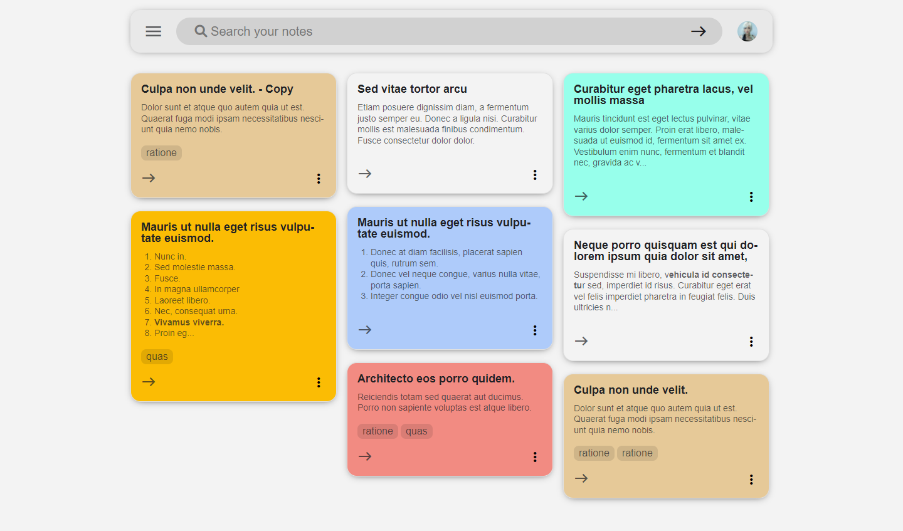

# Note-app (Laravel Application):

---

Quickly capture what's on your mind and write it down so you don't forget it. This Laravel app can:

-   Add notes.
-   Find what you need fast: by using different colors in the notes, or using labels to classify them by topic. Or if you need to find something you saved, a simple search will turn it up.
-   Send the notes you don't need to the trash and restore them at any time if you regret it
-   With its responsive design you can use it comfortably and efficiently on both mobile and desktop devices.

Some functionalities of the application are:

-   Image storage.
-   Use of different types of Eloquent relationships.
-   Authentication and user registration.

## Screenshot:

## How to install in local:

1. Run `git clone https://github.com/josedanielchg/note-app`
2. Go to project folder `cd note-app/`
3. Run `composer install`
4. Copy `.env.example` file to `.env` on the root folder. You can type `copy .env.example .env` if using command prompt Windows or `cp .env.example .env` if using terminal,
5. Open your `.env` file and change the database name `DB_DATABASE` to whatever you have, username `DB_USERNAME` and password `DB_PASSWORD` field correspond to your configuration.
6. Run `php artisan key:generate`.
7. Run `php artisan storage:link`.
8. Run `php artisan migrate`.
9. Run `php artisan serve`.
10. Go to `http://localhost:8000/`.
11. Register and get started (No email or spam will be sent to you)
